### Before performing the practical on control valve one must be well versed with:

* Basics of flow theory including Bernoulli's equation.
* Pneumatic system components
* Controller theory

## 1) Identify various compoments of a pneumatically operated control valve.

In today's modern plants, processes are controlled to achieve desired objectives. Control can either be manual or automatic. Manual control involves human intervention and entails human efforts and causes errors whereas in automatic control, no human intervention is required rather sensor, controller and control valve are used to automatically control a system to force the system parameters to desired levels.

Control valve is final control element in the control loop which exerts direct influence on the process. This element accepts input from the controller then transferred it to some proportional operation performed on the process. A valve controls system or process fluid flow and pressure by performing any of the following functions:

* Stopping and starting fluid flow
* Varying (throttling) the amount of fluid flow
* Controlling the direction of fluid flow
* Regulating downstream system or process pressure
* Relieving component or piping over pressure

The control valve have basic components like valve body, bonnet, stem, actuator, valve plug and seat.

### Valve body
A housing for internal parts having inlet and outlet flow connections. The body, sometimes called the shell, is the primary pressure boundary of a valve. It serves as the principal element of a valve assembly because it is the framework that holds everything together. Valve bodies are cast or forged into variety of shapes. Sphere or a cylinder would theoretically be the most economical shape to resist fluid pressure when a valve is open.

### Bonnet
The bonnet enclosed the valve plug in the valve body. Some bonnets function simply as valve covers, while others support valve internals and accessories such as the stem, disk, and actuator. The bonnet is the second principal pressure boundary of a valve. It is cast or forged of the same material as the body and is connected to the body by a threaded, bolted, or welded joint.

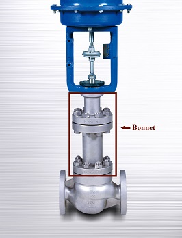

### Valve actuator
A valve actuator is a mechanical device that uses a power source to operate a valve. This power source can be electric, pneumatic (compressed air), or hydraulic (the flow of oil). The actuator operates the stem and disk assembly. Except for certain hydraulically controlled valves, actuators are outside of the pressure boundary.

### Plug or disk
A valve plug is movable part which provides a variable opening in a port and provides capability for permitting and prohibiting fluid flow. When the plug is closed, full system pressure is applied across it if the outlet side is depressurized. For this reason, the plug is a pressure-retaining part. The disk or plug is the third primary principal pressure boundary.

### Seat or seal ring
The seat provide the seating surface for the disk/plug, comes in contact with the valve plug to seal the valve tight during close position. In some designs, the body is machined to serve as the seating surface and seal rings are not used. In other designs, forged seal rings are threaded or welded to the body to provide the seating surface.

### Stem
The seat provide the seating surface for the disk/plug, comes in contact with the valve plug to seal the valve tight during close position. In some designs, the body is machined to serve as the seating surface and seal rings are not used. In other designs, forged seal rings are threaded or welded to the body to provide the seating surface.

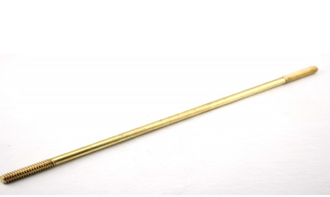

## 2) Explain various terminologies used while selecting a control valve.
In the application of control valve, many terminologies are used that may sometimes sound confusing and ambiguous. Here are some common terms to aid understanding of the application of control valve.

### Flow coefficient Cv
Flow coefficient Cv: The valve flow coefficient or valve flow capacity. Cv is the water flow rate, in gallons per minute, that causes a one psi pressure drop across a fully open valve.

### Head pressure
Head pressure: The maximum pressure a pump can exert in a piping system, usually indicated in feet of water units. The significance is that the valve.

### Valve fail mode
Valve fail mode: This is the position to which the control valve closure member moves when actuating energy source fails.

* Fail to open: A condition where the valve closure member moves to an open position when actuating energy source fails.
* Fail to close: A condition where the valve closure member moves to closed position when actuating energy source fails.
* Fail in place: A condition where the valve closure stays in its last position when actuating energy source fails.

### Capacity
Capacity: The rate of flow through a valve under stated test conditions.

### Control valve gain
Control valve gain: The change in the flow rate as a function of the change in valve travel.

### Hysteresis
Hysteresis: The maximum difference in output value for any single input value during a calibration cycle, excluding errors due to dead band.

### Dead band
Dead band: The range through which an input can be varied without initiating an observable response.

### Rangeability
Rangeability: The Ratio of maximum valve flow capacity to minimum controllable flow capacity.

### Linear flow
Linear flow: A flow characteristic that controls flow linearly to the actuator stroke. This is commonly used for two-position control and some quick opening applications

### Equal percentage
Equal percentage: A flow characteristic which controls flow exponentially (non-linear) compared to the actuator stoke

### Throttling
Throttling: The action of a control valve to regulate fluid flow by varying the position of the closure member and it causes variable pressure drop.

### Cavitation
Cavitation: Cavitation occurs when the pressure of a flowing liquid falls below the liquid's vapor pressure, vaporization occurs and bubbles form. As the pressure recovers bubbles collapse suddenly. This transformation can damage valve and piping surfaces.

### Flashing
Flashing: Flashing occurs in the liquid flow when the internal pressure of the liquid falls below the vapor pressure and remains below it. During this phase vapor bubbles form and flow with the liquid downstream at increased velocities and this causes erosion to valves and piping.

### Valve travel
Valve travel: Valve travel is the movement of closure member from the closed position to an intermediate or rated full position.

### Liquid pressure recovery factor (FL)
Liquid pressure recovery factor (FL): It is the ratio of valve coefficient (Cv) based on the pressure at the vena contracta, to the usual flow coefficient (Cv) which is based on overall pressure drop across the valve in non vaporizing liquid service.

## 3) Calculate the parameters required for sizing of a pneumatically operated control valve.
The successful operation of process plant and systems involves the highest level of measurement and control performance. Control valves therefore perform a key function in this process. A correctly sized control valve can increase process availability, reduce process variability and reduce maintenance costs. Careful consideration should therefore be given to the correct sizing of system control valves. Control valve sizing procedures are based on accepted mathematical methods such as those detailed in ISA-75.01.01-2007 a Flow Equations for Sizing Control Valves.

In the following sections, the nomenclature and procedures for control valve sizing for different flow mediums are explained.

### Sizing Valves for Liquids
Following is a step-by-step procedure for the sizing of control valves for liquid flow using the IEC procedure. Each of these steps is important and must be considered during any valve sizing procedure.

### 1. Specify the required parameters to size the valve as follows.
* Process fluid: water, oil, etc.
* Appropriate service conditions: q, P1, P2 or 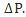, T1, Gf, Pv, Pc, and 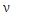

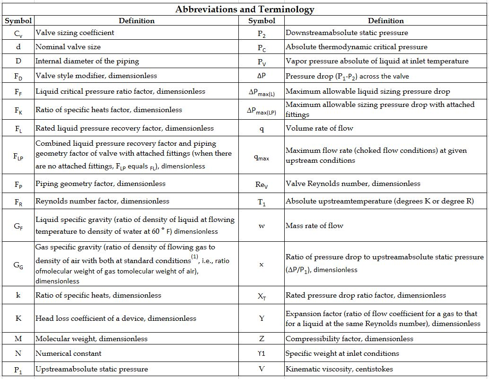

### 2. Determine the equation constant N
N is a numerical constant contained in each of the flow equations for using different systems of units. e.g Use N1, if sizing the valve for a flow rate in volumetric units (gpm or m^3/h).(See table 2 equation constant)

### 3. Determine FP, the piping geometry factor.
FP is a correction factor that accounts for pressure losses due to piping fittings such as reducers, elbows, or tees that might be attached directly to the inlet and outlet connections of the control valve to be sized.

* If such fittings are attached to the valve, the FP factor must be considered in the sizing procedure and calculate using following equation.
where,

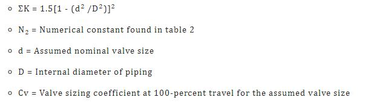

* If no fittings are attached to the valve, FP has a value of 1.

### 4. Determine  (the allowable sizing pressure drop).

(the allowable sizing pressure drop) can be determined from the following relationships:

* For valves installed without fittings:

* For valves installed with fittings attached:

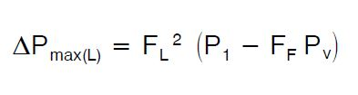

* P1 = Upstream absolute static pressure
* P2 = Downstream absolute static pressure
* Pv = Absolute vapor pressure at inlet temperature
* FF = liquid critical pressure ratio factor
* FL = Select from flow coefficient table

Calculated  compare with actual service pressure differential i.e 

* If , choked flow conditions will exist under the service conditions specified then step 6 of the procedure for Sizing valves for liquids must be modified by replacing the actual service pressure differential (i.e., P1 - P2) in the appropriate valve sizing equation with the calculated  value.

* If 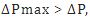, flow will not be chocked under the service conditions specified then in the step 6 of the procedure for Sizing valves for liquids must be calculated with actual pressure drop i.e .

### 5. Determine FR, the Reynolds number factor.
FR is a correction factor to account for non turbulent flowing conditions within the control valve to be sized. For most valve sizing applications, non turbulent flow will not occur.

* If it is known that non turbulent flow conditions will not develop within the valve, FR has a value of 1.0.
* If the non turbulent flow condition occurs use the equation of Reynolds number. where,

* N2, N4 = Numerical constants determined from table 2
* D = Internal diameter of the piping
*  = Kinematic viscosity of the fluid
* Cv= Cvt, the pseudo sizing coefficient

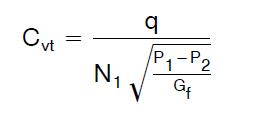

* If Rev is less than 56, the flow is laminar, and FR can be found using equation: 
* If Rev is greater than 40,000, the flow can be taken as turbulent, and FR= 1.0.
* If Rev lies between 56 and 40,000, the flow is transitional, and FR can be found by using standard table.

### 6. Solve for required Cv, using the appropriate equation:
* For volumetric flow rate units

* For mass flow rate units-	

### 7. Select the valve size using the flow coefficient table and the calculated Cv value.

## Sizing Valves for compressible fluids:

### 1. Specify the required parameters to size the valve as follows.
* Process fluid: air, natural gas, steam etc.
* Appropriate service conditions: q or w, P1, P2 or 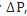, T1, Gg, M, k,z and 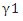 (abbreviations are given in the table no 1)

### 2. Determine the equation constant N:
N is a numerical constant contained in each of the flow equations for using different systems of units.

Use either N7 or N9 if sizing the valve for a flow rate in volumetric units (i.e. scfh or m^3/h). Which of the two constants to use depends upon the specified service conditions, N7 can be used only if the specific gravity, Gg, of the flowing gas has been specified. N9 can be used only if the molecular weight, M, of the gas has been specified.
Use either N6 or N8 if sizing the valve for a flow rate in mass units (i.e.,lb/h or kg/h). Which of the two constants to use depends upon the specified service conditions, N6 can be used only if the specific weight,  of the flowing gas has been specified.N8 can be used only if the molecular weight, M, of the gas has been specified.

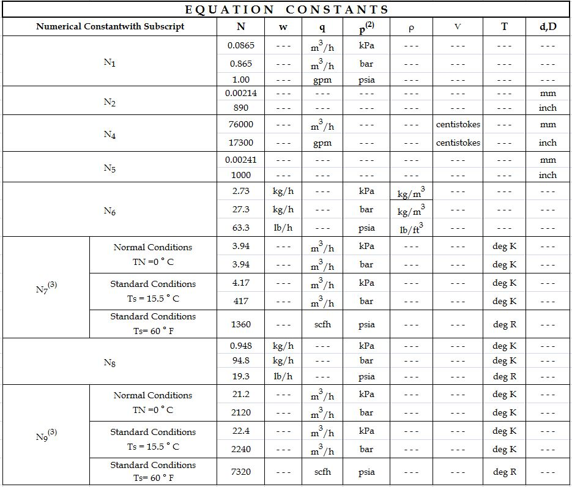

### 3. Determine FP, the piping geometry factor.
FP is a correction factor that accounts for pressure losses due to piping fittings such as reducers, elbows, or tees that might be attached directly to the inlet and outlet connections of the control valve to be sized. If such fittings are attached to the valve, the Fp factor must be considered in the sizing procedure. If no fittings are attached to the valve, FP has a value of 1.

### 4. Determine Y, the expansion factor.
where,

* Fk = k/1.4 the ratio of specific heats factor
* k = Ratio of specific heats
* x = P/P1, the pressure drop ratio
* XT = The pressure drop ratio factor for valves installed without attached fittings.
* When value of x become equal to or exceed the appropriate value of the product of either Fk XT or Fk XT P at which point: Y = 0.667

### 5. Solve for the required Cv using the appropriate equation:
* For volumetric flow rate units
  * If the specific gravity, Gg, of the gas has been specified:
  
	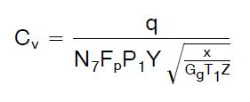
  
  * If the molecular weight, M, of the gas has been specified:

	

* For mass flow rate units-
	* If the specific weight of the gas has been specified:
	
	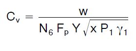
	
	* If the molecular weight, M, of the gas has been specified:

	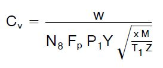

### 6. Select the valve size using the appropriate flow coefficient table and the calculated Cv value.

##  4) Assemble a pneumatically operated control valve from the loose components stored in library.

Control valve is the final control element in the system and used in conjunction with an actuator or actuation system along with other main components like valve body, bonnet, plug, stem etc.

### Actuator
An actuator is an assembly of diaphragm, spring and actuator stem fitted to the control valve to provide power for movable parts like plug, ball or disk. The actuator accepts signal from the control system and moves the valve plug to fully open or close position or an intermediate position. Actuator can be classified in different ways like types of drive power and direction of movement of stem.

### Types of actuator
Three principal types of actuator drive powers like:

* Pneumatic
* Hydraulic
* Electric

Pneumatically operated diaphragm actuators use air supply from controller, positioner or any other source. Pneumatic action can be accomplished in two ways:

* Direct acting
* Reverse acting

#### Direct acting:
In this type of actuator, air pressure pushes down the diaphragm and extends the actuator stem to close the valve. When air pressure released, the stem is retracted by the compression spring.

#### Reverse acting:
Here air pressure pushes up the diaphragm and pulls up the actuator stem to open the valve. When air pressure released, the stem is pushed down by the compression spring.
Diaphragm actuator: Diaphragm actuator works on the principle of gauge pressure i. e difference between input pressure signal and atmospheric pressure. P=F*A Where,
P = Pressure difference
A = Diaphragm area
F = Force

Diaphragm actuator consists of a diaphragm made of rubber and is sandwiched between two circular steel discs. The diaphragm is mounted in upper chamber where the varying pressure from controller is applied.
The bottom chamber contains a spring that forcing the diaphragm and connected to shaft down against the spring force.

As shown in the figure spring and diaphragm pneumatic actuators is 'direct-acting', meaning that air to the diaphragm casing pushes the actuator stem downward. This 'air-to-close' action compresses the spring, which in turn pushes the actuator stem back up when the supply pressure is decreased.

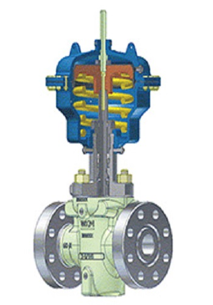

### Valve body
The valve body contains orifice and is the main housing through which the fluid flows. It has direct connection to the flow and pipeline therefore the size and material must be chosen accordingly. It serves as the principal element of a valve assembly because it is the framework that holds everything together. There are few types of valve body structure like:

* Single ported: 1 plug with 1 seat
* Double ported: 2 plug with 2 port
* Two way valve
* Three way valve

### Bonnet
The Bonnet is an assembly that provides a mounting for the actuator and a guide through which the stem must pass. It serves as the mounting base for the actuator. It is composed of the centerpiece, packing, packing guide, and packing nut. The packing provides a seal between the stem and bonnet to prevent leakage. The bonnet is connected with the body by a threaded, bolted, or welded joint connections - and gaskets are used in between the body and the bonnet. Control valves are fitted with following types of bonnets

* standard bonnet
* extension bonnet
* bellow seal bonnet

The basic criterion in selection of bonnet is fluid temperature. Extension bonnets are used in both high and low temperatures. Bellow seal bonnets ensure absolute internal tightness and they are used mostly for aggressive media. Standard bellow seal bonnets can be used up to pressure 35 bar.

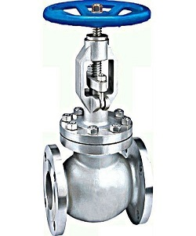

### Plug/disk
The shape of the valve plug determines the flow characteristics of the valve. The most efficient valve is one with linear flow characteristic hence efforts are made during the valve sizing process to approximate as possible to a linear flow characteristic. The typical design of equal percentage, linear and quick opening valve plugs shown below

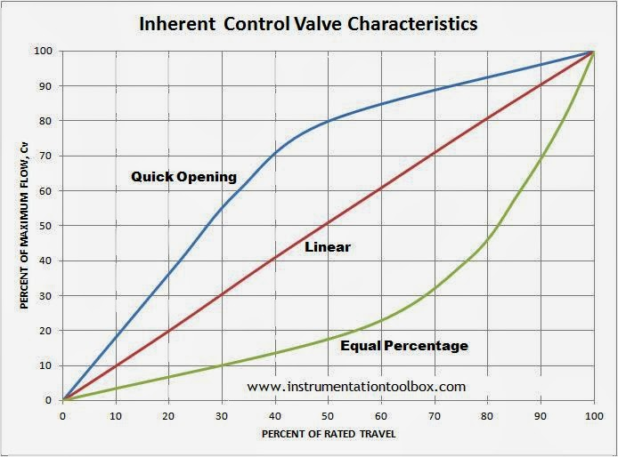

The percent of flow through the valve is plotted against valve stem position. The curves shown are typical of those available from valve manufacturers. These curves are based on constant pressure drop across the valve and are called inherent flow characteristics.

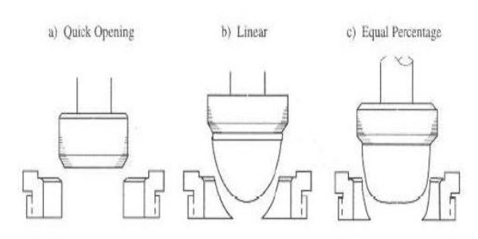

* Linear - flow capacity increases linearly with valve travel.
* Equal percentage - flow capacity increases exponentially with valve trim travel. Equal increments of valve travel produce equal percentage changes in the existing Cv.
* Quick opening - provides large changes in flow for very small changes in lift. It usually has too high a valve gain for use in modulating control. So it is limited to on-off service, such as sequential operation in either batch or semi-continuous processes.

### Stem
The stem of a valve is used to open or close the valve because it moves the disc/plug inside the valve. The stem is linked to the valve actuator at one end and is connected to the valve disc/plug on the other end. Stems are typically forged and connected to the disk by threaded or welded joints. To prevent the leakages of the valve, a proper finish of the stem surface is necessary. There are different types of stems like rotary, sliding, rising stem with outside screw and yoke, rising stem with inside screw and non-rising stem with inside screw.

### Packing
The selection of stem (or shaft) packing for a control valve must be done taking into account very important factors such as

* Temperature of process fluid
* Characteristics of fluid
* Working pressure

The gasket that seals the stem with the bonnet is called packing and it comprises may components like gland which is type of bushing compresses the packing by a gland onto the stuffing. Stuffing box is a chamber in which the packing gets compressed. A backseat is a seating inside the bonnet. The back seat provides a seal between the stem and bonnet and prevents system pressure from building against the valve packing once the valve is fully open. The valve packaging shall be properly designed and manufactured to minimize the possible damages to the stem and minimize the risk of leakages of fluids whereas it is necessary to observe that a too tight packing may affect the stem.

### Positioner
A valve Positioner is a device used to increase or decrease the air load pressure driving the actuator until the valve's stem reaches a required position balanced to the output signal from the process variable instrument controller and it is used where accurate and rapid control is required without error or hysteresis.

The valve positioner is a force-balanced instrument, with pneumatic module installed on a double-acting actuator for air to open action. Positioning is based on a balance of two forces; one proportional to the instrument signal and the other proportional to the stem position.

The input pressure from the controller (3 to 15 psi) to the bellows falls. The flapper moves away from the nozzle and the pressure after the orifice falls. The pressure to the diaphragm falls and the valve begins to close. The feedback arm moves up rotating the cam clockwise. This raises the beam increasing back pressure in the nozzle until equilibrium is again achieved. The change over cock allows the signal from the controller to be placed directly on the diaphragm.

## 5) Design a diaphragm actuator and control valve for the described application.

A valve actuator is device used to open or close by pneumatic, hydraulic or electric source.

Some of the basic functions of valve actuator like:

* Provide enough thrust to operate the valve
* Hold the valve plug/disc/ball at required position
* Operate the valve through its full travel at rated speed
* Provide fail safe mode in the event of power failure
* Prevent excessive forces under unfavorable conditions

In the diaphragm actuator opening, closing and throttling of the valve plug is accomplished by varying the air pressure to the diaphragm. Typically the control pressure signal is 3 to 15 psig. There are two types of actuators: Air-To-Close and Air-To-Open.

that a too tight packing may affect the stem.

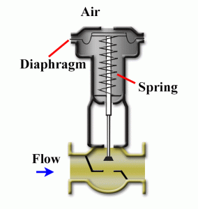

In Air-To-Close actuators, as the pressure signal is increased, the diaphragm pushes down, moving the stem and plug down, and compressing the range spring. As the pressure signal is decreased, the range spring pushes the diaphragm up, moving the valve stem and plug up.

### Diaphragm actuator sizing
This actuator is ideal for use on valve requiring linear travel. While selecting actuator following parameters must be considered

* Valve type and size
* Pressure drop
* Services and operating condition
* Flow medium
* Fail safe operation
* Operating temperature
* Stem orientation
* Type of control

### The steady state equation
In the spring and diaphragm actuator stem positioning is achieved by a balance of forces acting on the stem. These forces are due to pressure on the diaphragm, spring travel and fluid forces on the valve plug. PA - KX - PvAv = 0

This equation is the summation of forces on the valve plug adopting the positive direction downward. Where A is effective diaphragm area, Av is the effective inner valve area, K is the spring rate, P is the diaphragm pressure, Pv is the valve pressure drop and X is the stem travel. This equation is applicable to air to close actuator and valve combination with flow under the plug. This type of actuator is commonly referred to as direct acting. In this equation friction and inertia are not considered. Friction occurs in the valve stem packing, in the actuator stem guide and in the valve plug guide. With considering the plug forces due to fluid flow, additional actuator force is required to maintain balance. The actuator pressure required to begin stem motion.

## 6) Investigate the reasons for the malfunctioning of the valve under test.

